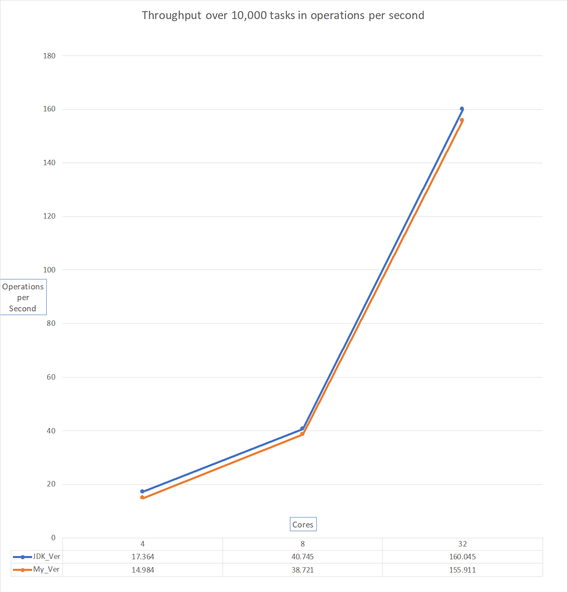

# ConcurrentBankSimulator

Simulates a simple stripped-down bank, using multi-threading. One version using JDK components, and another of my own creation based off existing methods.
Benchmarked with JMH over some standard that will later be determined.
Done for CSC375 - Parallel Programming with Doug Lea.

Benchmarking results:

